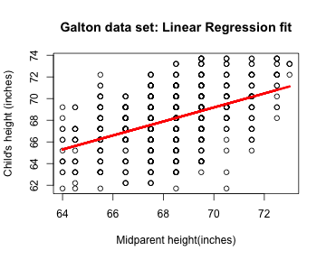

## Synopsis
- A web app that predicts child's height based on the input father's and mother's height
- Uses the _galton_ dataset from the _UsingR_ package
    - built from a tabulated data set used by Galton in 1885 
        - relationship between a parent's height and their children's
    - 928 observations on 2 variables (928 children and 205 parents)
        - child : the child's height
        - parent : the "midparent" height 
            - average of the fathers height and 1.08 times the mother's
- A linear model is built from the dataset for the purpose of child height prediction
- The predicted height is shown along with the 95% confidence interval
- Frequency distributions of parent's height and child height are also shown
    - purpose is to illustrate _Regression toward the mean_

--- .class #id 

## Providing Input
- The mean, min and max values for parent height in _galton_

```
## [1] "Mean:  68.3081896551724"
```

```
## [1] "Min:  64"
```

```
## [1] "Max:  73"
```

- Since the above values are for "midparent" height, inputs slightly lower and higher are allowed for father's and mother's height
- Use the sliders to provide input values for father's height and mother's height
    - initial defaults are set to be close to the mean
- "midparent" height is computed by the app using your inputs and displayed

---
## Prediction using a Linear Model
- The linear model built using the _galton_ dataset

 
- A sample prediction (fit - fitted value lwr,upr - bounds of 95% confidence interval)

```r
predict(model, data.frame(parent=c(70)), interval="confidence")
##     fit   lwr   upr
## 1 69.18 68.98 69.38
```

---
## Regression towards the mean
- When "midparent" height is significantly higher than the mean, child height is not as much higher than its mean
- When "midparent" height is significantly lower than the mean, child height is not as much lower than its mean
- This is illustrated via the frequency distribution plots displayed by the app
